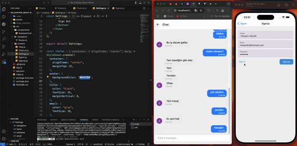

# ChatApp React-Native

React Native ile geliştirdiğim  işlevsel bir Sohbet Uygulaması olan projemi sizlerle paylaşıyorum. Gerçek zamanlı mesajlaşma ve kullanıcı dostu bir arayüzü bir araya getiren bu uygulama, modern teknolojilerle tasarlandı. 

Öne Çıkan Özellikler:
✔️ Gerçek zamanlı veritabanı ve kimlik doğrulama için Firebase entegrasyonu.
✔️ React Navigation ile sezgisel gezinme deneyimi.
✔️ Şık ve modern UI tasarımı için React Native Paper.
✔️ Gelişmiş mesajlaşma özellikleri için React Native Gifted Chat.
✔️ Expo ile çapraz platform uyumluluğu.

Projede Firebase, React Native, Expo ve daha birçok güçlü kütüphane kullanarak sorunsuz ve etkileyici bir kullanıcı deneyimi sağladım.

GitHub hesabım üzerinden projeyi inceleyebilir ya da yenilikçi mobil uygulama projeleri için benimle iletişime geçebilirsiniz! 

#ReactNative Developer #MobilUygulama #Firebase #Front-End Developer #Software Developer

###  Designed by <a href="https://www.linkedin.com/in/h%C3%BCseyin-aslan-128519203/" target="_blank">Hüseyin ASLAN</a> 

## Gif

